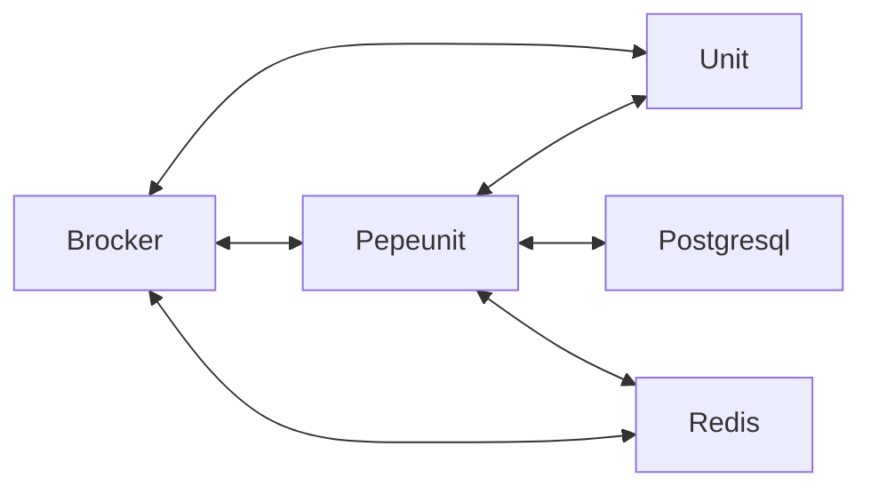

# Зависимости Pepeunit

::: tip Для чего нужны зависимости приложению Pepeunit?
Зависимости - дополнительные приложения требующиеся для корректной работы [Pepeunit](/definitions#pepeunit)
:::

### [Postgresql](/definitions#postgresql)

1. Хранит информацию о всех сущностях - [Repo](/definitions#repo), [Unit](/definitions#unit), [UnitNode](/definitions#unitnode)
1. Хранит шифрованную информацию.
1. Хранит информацию о доступах и видимости.
1. Взаимодействует напрямую с [Backend](/definitions#backend).

---

### [Redis](/definitions#redis)

1. Обеспечивает кэширование и хранение промежуточной информации о состоянии [UnitNode](/definitions#unitnode), во время общения [Unit](/definitions#unit) к [MQTT Broker](/definitions#mqtt-broker).
1. Используется также для авторизации [Backend](/definitions#backend) в момент подписки на основные топики `example.com/+/pepeunit` и `example.com/+/+/+/pepeunit` в [MQTT Broker](/definitions#mqtt-broker).
1. Взаимодействует напрямую с [Backend](/definitions#backend) и [MQTT Broker](/definitions#mqtt-broker).

---

### [MQTT Broker](/definitions#mqtt-broker)

1. Обеспечивает прямое взаимодействие через 1883 и 8883 порты между [Unit](/definitions#unit) и [Backend](/definitions#backend). Его можно назвать рельсой данных, на которую завязано основное взаимодействие.

::: tip Ключевые моменты взаимодействия [MQTT Broker](/definitions#mqtt-broker) и [Backend](/definitions#backend)
[Backend](/definitions#backend) выполняет функцию регулятора, а именно:
1. Авторизация всех [Unit](/definitions#unit) для доступа к определённым топикам
1. Агрегация данных из определённых топиков, согласно политике имён топиков
1. Управление [Unit](/definitions#unit), при помощи системы комманд, которые позволяют публиковать в опредённые топики задания на обновление schema.json, env.json или программы целиком.
:::

Брокер `EMQX` на два порядка производительней чем [Backend](/definitions#backend), но благодаря системе кэширования авторизации `EMQX` и кэшированию через [Redis](/definitions#redis), [Backend](/definitions#backend) может справится с нагрузкой.

---

### Общая схема взаимодействия

