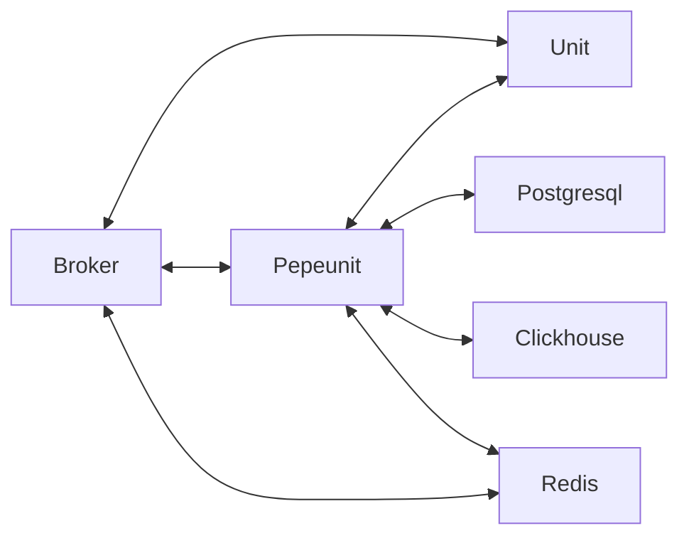

# Зависимости

## Postgresql

[Postgresql](https://www.postgresql.org/docs/) - открытая, кластерная реляционная база данных с языком запросов `SQL`. [Pepeunit](/conception/overview) использует её для:

1. Хранения информации о всех сущностях - [Repo](/definitions#repo), [Unit](/definitions#unit), [UnitNode](/definitions#unitnode)
1. Хранения [шифрованной](/mechanics/cipher) информации
1. Хранения информации о [доступах](/mechanics/permission) и [видимости](/mechanics/visibility)

## EMQX MQTT Broker

[EMQX MQTT Broker](https://docs.emqx.com/en/emqx/latest/) - это серверное приложение, которое координирует сообщения между издателями и подпищиками [MQTT](/definitions#mqtt-broker) протокола. Брокер обеспечивает взаимодействие через `1883` и `8883` порты между [Unit](/definitions#unit) и [Backend](/definitions#backend). Его можно назвать рельсой данных, на которую завязано основное взаимодействие.

::: tip Ключевые моменты взаимодействия [MQTT Broker](/definitions#mqtt-broker), [Backend](/definitions#backend) и [Unit](/definitions#unit)
[Backend](/definitions#backend) выполняет [Административные](/mechanics/roles#admin) функции, а именно:
1. Авторизация всех [Unit](/definitions#unit) для доступа к определённым топикам
1. Агрегация данных из определённых топиков, согласно политике имён топиков
1. Управление [Unit](/definitions#unit), при помощи системы команд, позволяющей публиковать в топики задания на обновление [schema.json](/definitions#schema-json), [env.json](/definitions#env-json) или программы целиком.
1. Получение состояний [Unit](/definitions#unit) через специальный топик.
:::

Брокер `EMQX` на два порядка производительней чем [Backend](/definitions#backend), но благодаря системе кэширования авторизации `EMQX` и кэшированию через `Redis`, [Backend](/definitions#backend) может справится с нагрузкой.

## Clickhouse

[Clickhouse](https://clickhouse.com/) - это колончатая аналитическая СУБД с открытым исходным кодом, позволяющая выполнять аналитические запросы на структурированных данных. Используется [Backend](/definitions#backend) для хранения логов [Unit](/definitions#unit).

## Redis

[Redis](https://redis.io/) - `NoSQL` кластерная база данных использующая парадигму `key-value`

1. Обеспечивает кэширование и хранение промежуточной информации о состоянии [UnitNode](/definitions#unitnode), во время обращения [Unit](/definitions#unit) к [MQTT Broker](/definitions#mqtt-broker) через топики.
1. Используется также для авторизации [Backend](/definitions#backend) в момент подписки на основные топики `unit.example.com/+/pepeunit` и `unit.example.com/+/+/+/pepeunit` в [MQTT Broker](/definitions#mqtt-broker).

## Общая схема взаимодействия

