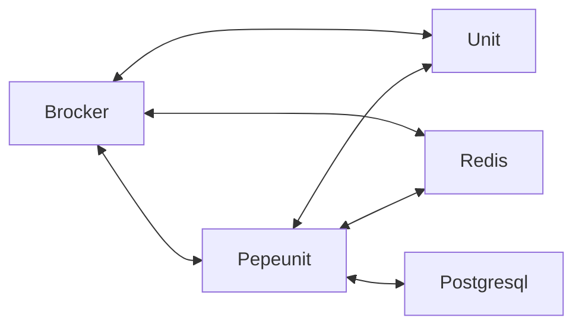

# Зависимости Pepeunit

::: tip Для чего нужны зависимости приложению Pepeunit?
Зависимости - дополнительные приложения требующиеся для корректной работы [Pepeunit](/definitions#pepeunit)
:::

### MQTT Broker EMQX

[MQTT Broker](/definitions#mqtt-broker) - обеспечивает прямое взаимодействие через 1883 и 8883 порты между [Unit](/definitions#unit) и [Backend](/definitions#backend). Его можно назвать рельсой данных, на которую завязано основное взаимодействие.

::: tip Ключевые моменты
[Backend](/definitions#backend) выполняет функцию регулятора, а именно:
1. Авторизация всех [Unit](/definitions#unit) для доступа к определённым топикам
1. Агрегация данных из определённых топиков, согласно политике имён топиков
1. Управление [Unit](/definitions#unit), при помощи публикации в опредённые топики
:::

[Unit](/definitions#unit) могут взаимодействовать напрямую между собой через [MQTT Broker](/definitions#mqtt-broker), если это определено политиками доступа к топикам, а [MQTT Broker](/definitions#mqtt-broker) в свою очередь запрашивает авторизацию у [Backend](/definitions#backend) для каждого из топиков.

Брокер `EMQX` на два порядка производительней чем [Backend](/definitions#backend), но благодаря системе кэширования авторизации `EMQX` и кэшированию через [Redis](/definitions#redis), [Backend](/definitions#backend) может справится с нагрузкой.

### База данных Postgresql

[Postgresql](/definitions#postgresql) - обеспечивает хранение информации о всех сущностях. Также обеспечивает сохранение статистической информации о состояниях [UnitNode](/definitions#unitnode) и данных о существующих [Узлах](/definitions#instance) [Pepeunit](/definitions#pepeunit). Взаимодействует напрямую с [Backend](/definitions#backend).

### Redis

[Redis](/definitions#redis) - обеспечивает кэширование и хранение промежуточной информации о состоянии [UnitNode](/definitions#unitnode), во время общения [Unit](/definitions#unit) c [MQTT Broker](/definitions#mqtt-broker). Используется также для авторизации [Backend](/definitions#backend) в момент подписки на основные топики `example.com/+/pepeunit` и `example.com/+/+/+/pepeunit` в [MQTT Broker](/definitions#mqtt-broker). Взаимодействует напрямую с [Backend](/definitions#backend) и [MQTT Broker](/definitions#mqtt-broker).

