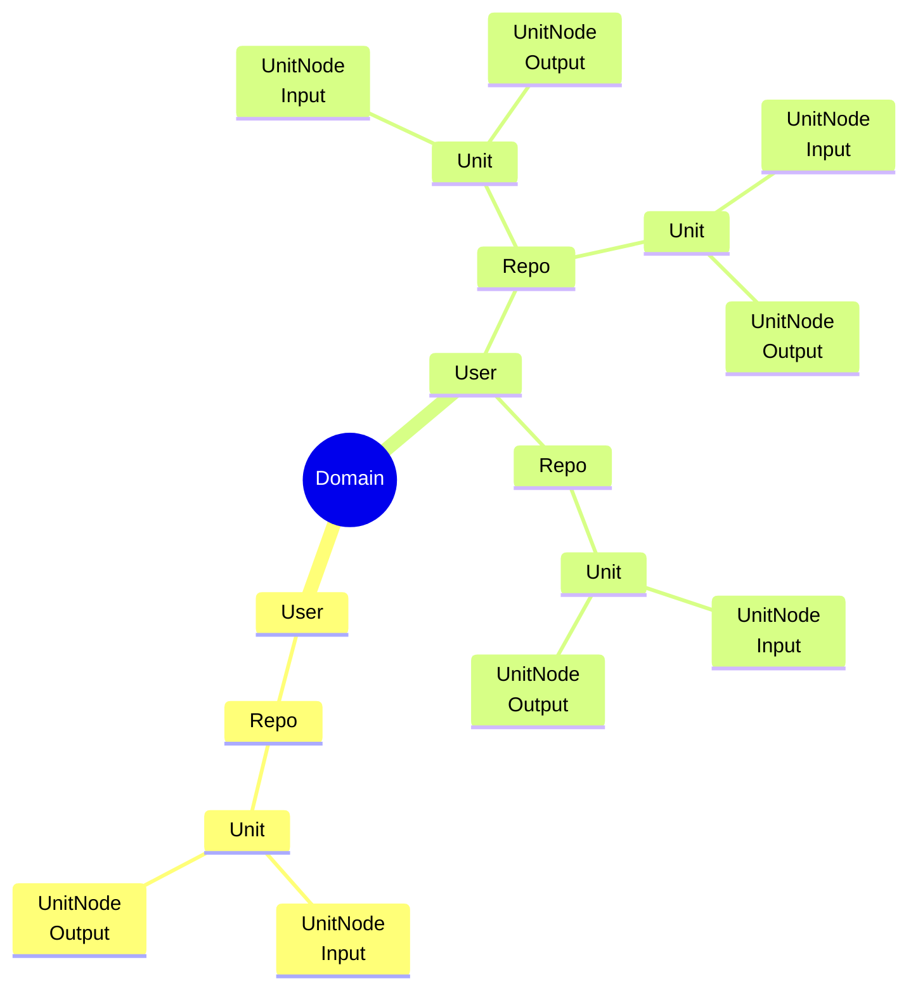

# Идеи функционала для Pepeunit

## Анализ нагрузки

1. Система анализа нагрузки от Unit
1. Система анализа средней нагрузки от Repo - нужно чтобы люди создавая новый Repo, знали сколько и чего он будет кушать
1. Добавить возможность итеративной проверки нагрузки, чтобы получить цифры, доступных лимитов у инстанса

## Монетизация

1. Подключаемая монетизация на основе Telegram и криптовалют
1. Основана должна быть на нагрузке от Unit, который создаёт юзер, нужно добавить возможность выбрать бесплатный лимит у админа

## Общий функционал

1. Федеративный хаб Repo, c поиском по Unit на мультиинстансе
1. Система грейдов инстансов, по нагрузке которую они способны держать
1. Пятиугольник состояния узла, сколько нагрузки он ещё способен выдержать
1. Агреггация данных через Redis с системой топиков, такие топики должны быть монетизированы с другой политикой
1. Проработать activity pub
1. Проработать взаимодействие различных инстансов
1. Проработать bridge y emqx, до разных инстансов
1. Проработать базовый функционал для Telegram Bot

## Функционал Фронтенда

1. Поиск по output для input
    - Поиск по видимости
    - Поиск по своим
    - Сортировки
1. Отображение node на графе:
    - link слой объединяющий множество Repo
    - Первые 2 не сжимаемые, остальные отображаются при клике
    - Нужны настройки пользователя, как он хочет видеть свой первичный граф
1. Поиск по графу:
    - пагинация в поиске по node
    - поиск только по своим
    - сортировки
1. Модификаторы поиска
    - Всегда идут в строгом порядке - Domain, User, Repo, Unit, UnitNode
    - Пользователю подсвечивается текущее положение
    - Пользователю подсвечиваются активные модификаторы
    - Пользователю видны крайние от подсвеченых - которые можно включить - например включен Repo, и отображены все его Unit. Это означает что пользователю будут доступны для клика 4 модификатора - User, Repo, Unit, UnitNode. User добавит на граф Создателя, Repo отобразит модалку Repo, Unit - уберёт с графа все Unit, UnitNode отобразит все UnitNode у Unit.

### Общая иерархия

