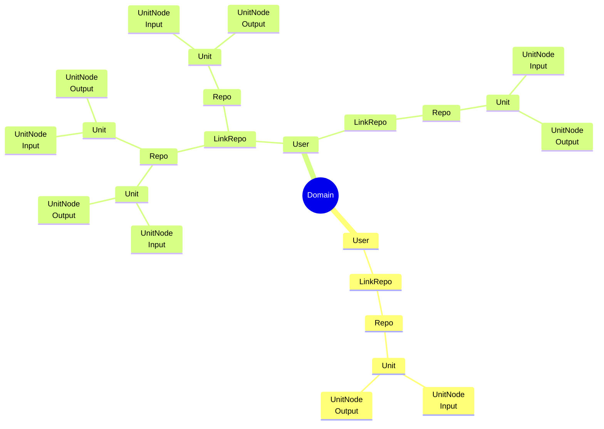
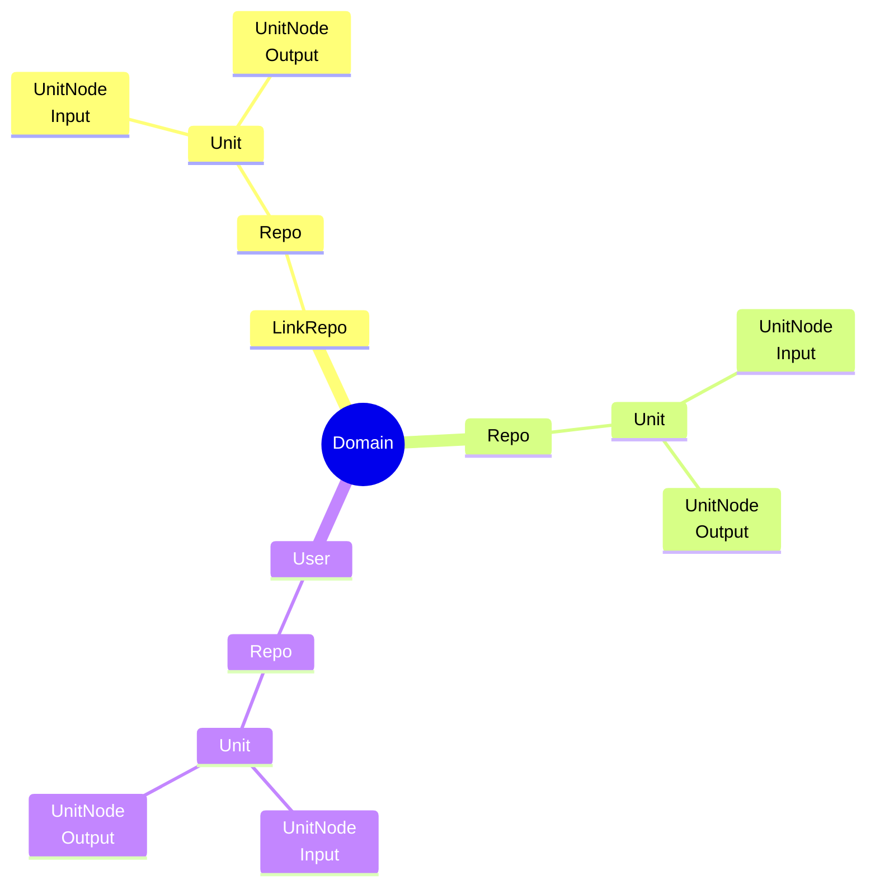

# Идеи функционала для Pepeunit

## Анализ нагрузки

1. Система анализа нагрузки от Unit
1. Система анализа средней нагрузки от Repo - нужно чтобы люди создавая новый Repo, знали сколько и чего он будет кушать
1. Добавить возможность итеративной проверки нагрузки, чтобы получить цифры, доступных лимитов у инстанса

## Монетизация

1. Подключаемая монетизация на основе Telegram и криптовалют
1. Основана должна быть на нагрузке от Unit, который создаёт юзер, нужно добавить возможность выбрать бесплатный лимит у админа

## Общий функционал

1. Федеративный хаб Repo, c поиском по Unit на мультиинстансе
1. Система грейдов инстансов, по нагрузке которую они способны держать
1. Пятиугольник состояния узла, сколько нагрузки он ещё способен выдержать
1. Агреггация данных через Redis с системой топиков, такие топики должны быть монетизированы с другой политикой

## Функционал Бэкенда

1. Проработать activity pub
1. Проработать взаимодействие баз данных различных инстансов
1. Проработать bridge y emqx, до разных инстансов
1. Добавить базовый топик для reset y Unit
1. Проработать базовый функционал для Telegram Bot
1. Добавить больше гарантий при работе с репозиториями:
    - статусы обновлений
    - даты обновлений
    - ошибки если они были
1. Рефактор возвращаемых ошибок

## Функционал Фронтенда

1. Полный рефактор стиля Pepeunit
1. Поиск по output для input
    - Поиск по видимости
    - Поиск по своим
    - Сортировки
1. Отображение node на графе:
    - link слой объединяющий множество Repo
    - Первые 2 не сжимаемые, остальные отображаются при клике
    - Нужны настройки пользователя, как он хочет видеть свой первичный граф
1. Поиск по графу:
    - нужен пикер поиска link, repo, unit, user, domain
    - нужно окно поиска текстом
    - нужен zoom в точку которую выберет пользователь из списка
    - пагинация в поиске по node
    - поиск только по своим
    - сортировки
1. Добавить обновление данных каждые N секунд, показывать компанент с обратным отсчётом до обновления
1. Добавить статистику по unit в repo
1. Добавить отображение state, для unit
1. Добавить систему Permissions
1. Проработать доступы для пользователя, не отображать если нет доступа создателя

### Общая модель отображения

### Возможности кастомизации структуры

- Для каждой роли должны быть установлены определённые пресеты отображения

