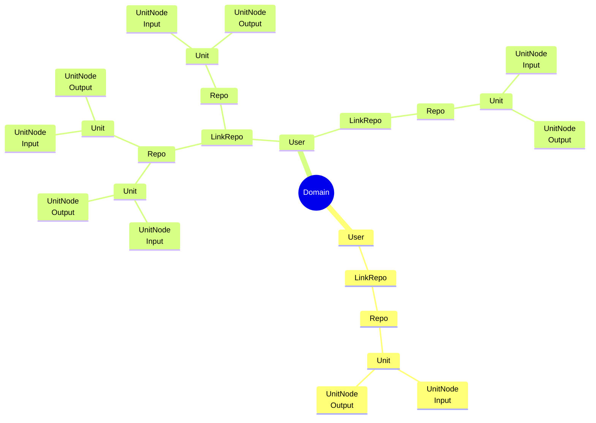
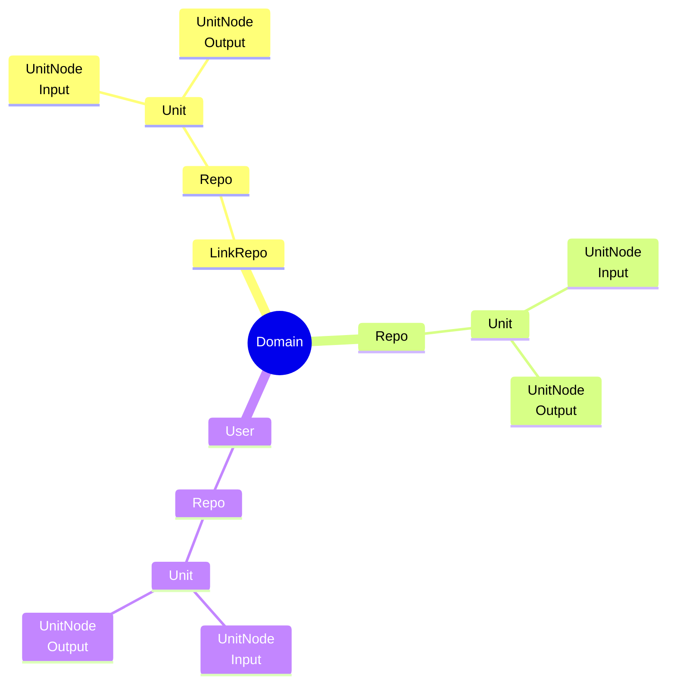

# Идеи функционала для Pepeunit

## Анализ нагрузки

1. Система анализа нагрузки от Unit
2. Система анализа средней нагрузки от Repo - нужно чтобы люди создавая новый Repo, знали сколько и чего он будет кушать

## Монетизация

1. Подключаемая монетизация на основе Telegram и криптовалют
2. Основана должна быть на нагрузке от Unit, который создаёт юзер, нужно добавить возможность выбрать бесплатный лимит у админа

## Общий функционал

1. Федеративный хаб Repo, c поиском по Unit на мультиинстансе
2. Система грейдов инстансов, по нагрузке которую они способны держать
3. Пятиугольник состояния узла, сколько нагрузки он ещё способен выдержать
4. Агреггация данных через Redis с системой топиков, такие топики должны быть монетизированы с другой политикой

## Функционал Бэкенда

1. Добавить возможность итеративной проверки нагрузки, чтобы получить цифры, доступных лимитов у инстанса
2. Проработать activity pub
3. Проработать взаимодействие баз данных различных инстансов
4. Проработать bridge y emqx, до разных инстансов
5. Проработать базовый функционал для Telegram Bot
6. Реорганизация верификации в Telegram, на более User Френдли
7. Добавить базовый топик для reset y Unit

## Функционал Фронтенда

1. При создании Repo, добавить окно пикер для link по уже существующим Repo
1. Первые два слоя не сжимаются, остальные в глубину отображаются только при клике
1. Раздельный поиск, c пикером по link, repo, unit, user. Обдумать первичнуб node для разных стратегий поиска
1. Для UnitNode добавить поиск по другим UnitNode у из доступных Unit
1. Добавить отображение UnitNode связанных с выбранным
1. Рассмотреть возможность поска по единичным элементам вне структуры, с отображением только пикнутого

### Общая модель отображения

### Возможности кастомизации структуры

- Для каждой роли должны быть установлены определённые пресеты отображения

